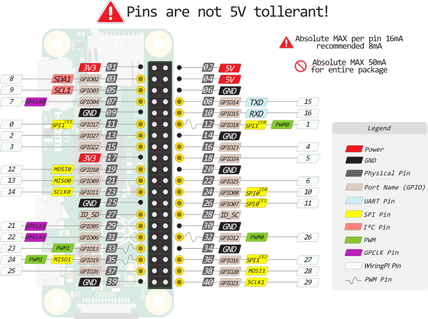

# Pi Tank

Raspberry Pi zero W v1.1 pinout:

## ssh connect

~~~
chmod 0600 ~/.ssh/pi_rsa
ssh -i ~/.ssh/pi_rsa pi@192.168.1.xx
~~~

## ssh mount

### install

~~~
sudo apt-get install sshfs
sudo adduser <username> fuse
~~~

### use

~~~
sshfs -o allow_other,default_permissions,IdentityFile=~/.ssh/pi_rsa,reconnect pi@192.168.1.xx:/ ~/mnt_ssh
fusermount -u ~/mnt_ssh
~~~

## see

https://www.waveshare.com/wiki/1.44inch_LCD_HAT

